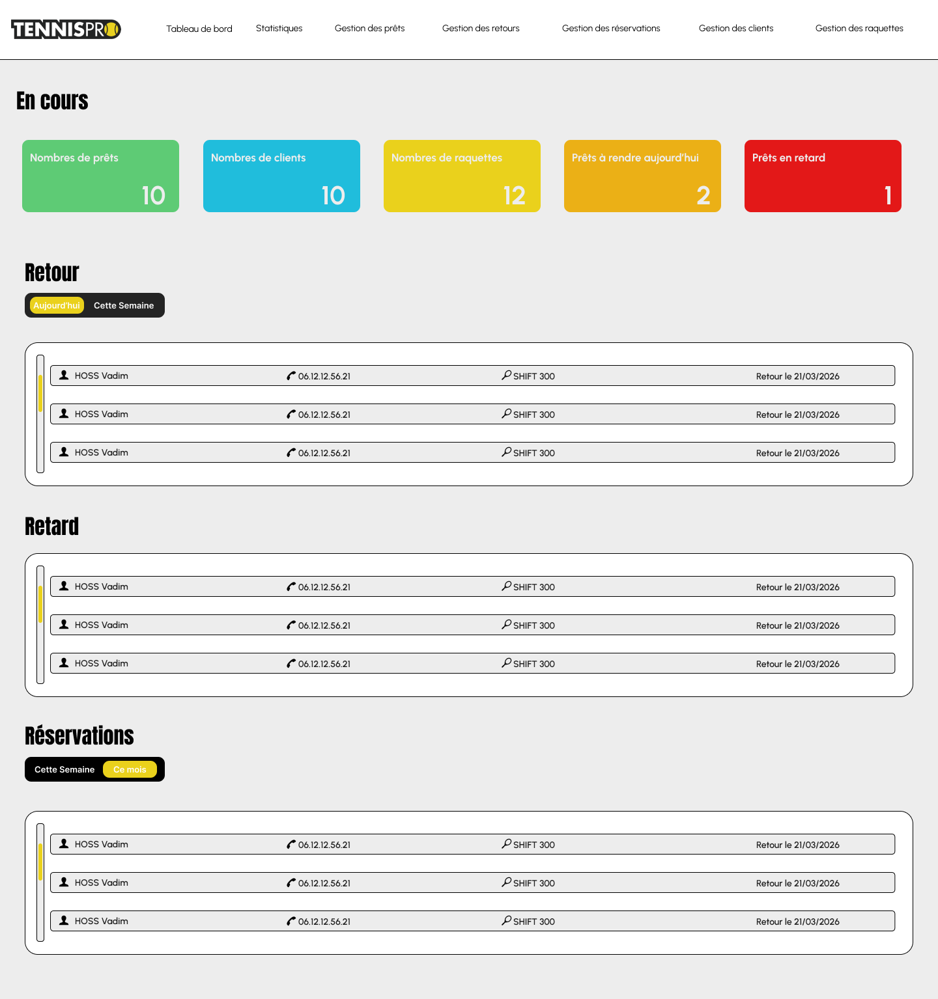
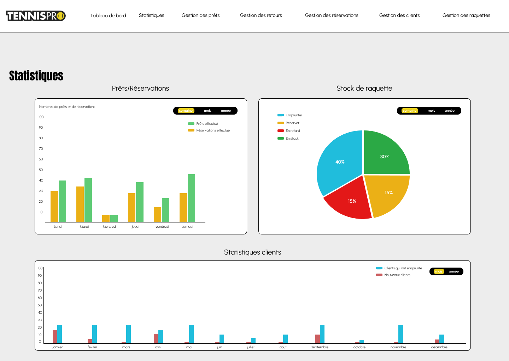
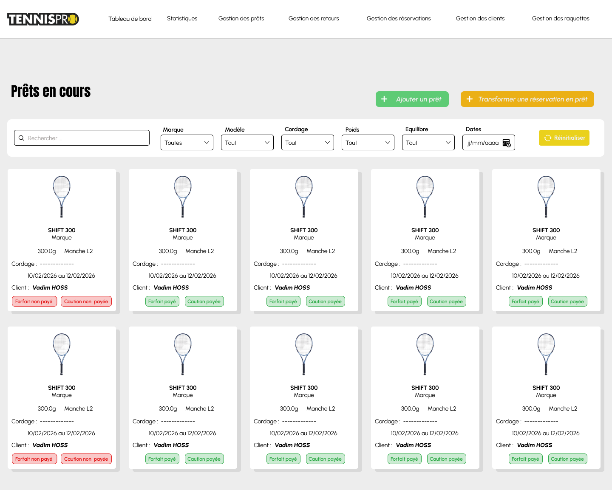

# Tennis Pro Application web - 2026

## Description
Ce projet se déroule du 9 février au 7 août 2026. J’occupe le rôle de **chargée de développement web**, en travaillant en **autonomie**.  
L’objectif est de créer une application web interne permettant de gérer les emprunts de raquettes de tennis, nommée “Raquettes Tests”. L’application gère les prêts en direct, la réservation si une raquette n’est pas disponible immédiatement, le retour des raquettes, la gestion des clients, la gestion des raquettes elles-mêmes, la gestion des internes, ainsi que des pages statistiques et une version admin offrant une vision globale du système.

Depuis le début du projet, j’ai réalisé l’**analyse des besoins** et rédigé le **cahier des charges**. J’ai conçu les **wireframes** et les **maquettes interactives** sur Figma. J’ai avancé sur la **base de données MySQL** en créant la structure, validée avec le client, puis j’ai commencé le **développement de l’application**. L’application est développée en **PHP** avec le framework **Laravel** pour le backend, utilise **TailwindCSS** pour le front-end et **Azure Microsoft** pour l'hébergement.

## Rôle et organisation
- Rôle : Chargée de développement web, travail en autonomie  
- Suivi par un tuteur (Chef de projet)  
- Méthode agile : sprints, epics et visualisation Kanban  
- Communication principalement via Teams  

## Objectifs de l'application
- Gestion des prêts et des réservations  
- Gestion des retours de raquettes  
- Gestion des clients (création et suivi)  
- Gestion des raquettes (état, emprunt actuel)  
- Pages statistiques  
- Version admin pour une vision globale du système  

## Avancement
- Analyse du besoin et rédaction du cahier des charges 
- Conception des wireframes et maquettes interactives sur Figma  
- Création de la base de données MySQL  
- Application web et base de données créées dans Azure Microsoft  
- Développement de l'application en cours  

## Technologies utilisées

## Images du projet

Pour des raisons de confidentialité, la majorité des écrans et du code ne peuvent pas être montrés.  
Les images ci-dessous sont un extrait de mon travail : 

  <!-- Tableau de bord Responsable Vendeur -->
  
  
  <!-- Statistiques -->
  
  
  <!-- Gestion des prêts -->
  

## Retour du tuteur
Le tuteur a été très positif, impressionné par la réalisation de toutes les maquettes en seulement deux semaines malgré les contraintes et les nouveaux éléments à intégrer en cours du projet.
